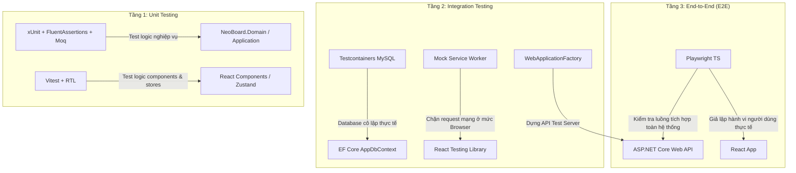
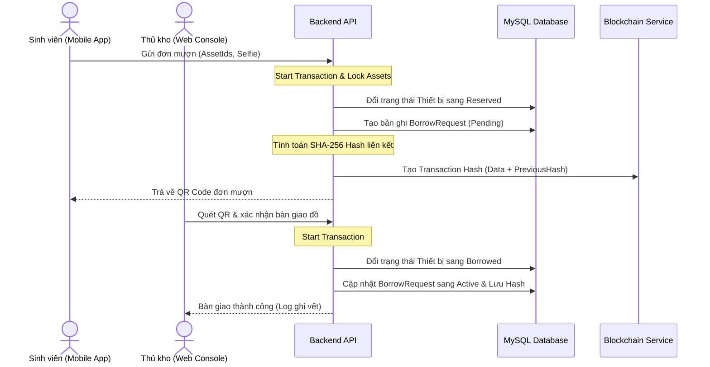

# 🧪 KẾ HOẠCH KIỂM THỬ TOÀN DIỆN HỆ THỐNG — NEOBOARD (EDU-AMS)
**Tác giả:** Technical Architect & QA Principal Expert (Strict Development Principles)
**Dự án:** NeoBoard - Hệ thống Quản lý Tài sản & Vòng đời Thiết bị Giáo dục
**Phiên bản:** 1.0 (Production-Ready)

---

## 1. TRIẾT LÝ KIỂM THỬ CỦA CHUYÊN GIA KHÓ TÍNH

Là một nhà phát triển phần mềm chuyên nghiệp, tôi coi **mã nguồn không có kiểm thử (tests) là nợ kỹ thuật (legacy code) ngay từ thời điểm được viết ra**. Một hệ thống quản lý tài sản doanh nghiệp tích hợp Blockchain-lite và theo dõi sức khỏe thiết bị như NeoBoard không thể vận hành dựa trên "niềm tin" rằng code sẽ chạy đúng. 

Chúng ta sẽ áp dụng các nguyên tắc nghiêm ngặt sau đây cho toàn bộ dự án:

1. **Nguyên tắc Không khoan nhượng với Test chập chờn (Zero-Tolerance for Flaky Tests):** Một test case pass 9 lần và fail 1 lần mà không rõ lý do là một test hỏng. Test chập chờn làm xói mòn lòng tin vào CI/CD. Nếu phát hiện test chập chờn, bắt buộc phải cách ly (quarantine), sửa triệt để hoặc xóa bỏ hoàn toàn để viết lại.
2. **Nguyên tắc Cách ly Tuyệt đối (Absolute Isolation):**
   - **Unit Tests:** Tuyệt đối không được kết nối mạng, đọc ghi file thật, hoặc gọi vào Database thật. Mọi dependencies ngoài vùng kiểm thử của class phải được Mock (sử dụng `Moq` ở Backend hoặc `Vitest Mock/MSW` ở Frontend).
   - **Integration Tests:** Phải chạy trên môi trường cơ sở dữ liệu độc lập và được làm sạch trước mỗi test case (sử dụng Database Transaction Rollback hoặc Testcontainers).
3. **Kiểm thử Đột biến (Mutation Testing):** Chỉ có độ bao phủ dòng code (Line Coverage) là chưa đủ. Chúng phải được đánh giá chất lượng qua Mutation Testing (Stryker) để chèn các lỗi logic giả lập vào code xem bộ test case có phát hiện ra hay không. Nếu điểm số kiểm thử đột biến < 80%, bộ test đó chưa đạt yêu cầu.
4. **Tự động hóa hoàn toàn (Continuous Integration):** Không ai được phép tự merge code bằng tay lên nhánh `develop` hoặc `main` nếu các bài test tự động bị thất bại trên GitHub Actions.

---

## 2. KIẾN TRÚC KIỂM THỬ & STACK CÔNG NGHỆ

Hệ thống NeoBoard được chia làm 3 tầng kiểm thử rõ rệt với các công nghệ được chuẩn hóa như sau:



### 2.1 Backend (.NET 9 ASP.NET Core)
*   **Unit Testing Framework:** `xUnit` (Được lựa chọn vì kiến trúc chạy song song độc lập cao, tránh side-effects chéo giữa các test class).
*   **Assertion Library:** `FluentAssertions` (Giúp viết các câu lệnh kiểm tra trực quan, dễ đọc như: `result.Should().BeEquivalentTo(expected)`).
*   **Mocking Tool:** `Moq` (Để giả lập các hành vi của Interface Service, Repository, Logger, HttpClient).
*   **Integration Testing:** `Microsoft.AspNetCore.Mvc.Testing` (`WebApplicationFactory`) để khởi tạo API Server ảo trong bộ nhớ, kiểm tra toàn bộ luồng request qua các Middleware, Filter, Model Binder cho đến Controller.
*   **Database Testing:** `Testcontainers for dotnet` kết hợp với image `MySQL:8.0`. Không dùng SQLite In-Memory vì SQLite không hỗ trợ đầy đủ các hàm JSON và cơ chế khóa dữ liệu (locking/concurrency) giống MySQL thật, dẫn đến kết quả test sai lệch so với production.

### 2.2 Frontend (React 19 + Vite 6 + TS)
*   **Unit/Component Test Runner:** `Vitest` (Thay thế hoàn hảo cho Jest trong hệ sinh thái Vite nhờ tốc độ khởi chạy cực nhanh và hỗ trợ Hot Module Replacement khi viết test).
*   **UI/Component Testing:** `React Testing Library` + `@testing-library/user-event` (Kiểm thử giao diện dựa trên góc nhìn của người dùng: click button, điền form, kiểm tra text hiển thị thay vì kiểm tra state nội bộ của component).
*   **API Mocking:** `Mock Service Worker (MSW)` (Chặn các request HTTP từ Axios lên Backend ở mức mạng và trả về dữ liệu mock có cấu trúc giống hệt API thật. Tránh việc mock các hàm fetch/axios thủ công dễ gây lỗi).

### 2.3 End-to-End (E2E) Testing
*   **Framework:** `Playwright` (Hỗ trợ chạy test đa luồng cực nhanh, tự động đợi phần tử xuất hiện trên DOM chống flaky test, hỗ trợ chụp ảnh/quay video màn hình khi test thất bại để phục vụ gỡ lỗi, và giả lập hoàn hảo camera thiết bị di động để quét QR Code/Selfie).

---

## 3. KỊCH BẢN KIỂM THỬ CHI TIẾT THEO TỪNG MODULE NGHIỆP VỤ

---

### 3.1 Module 1: Phân Quyền, Xác Thực & An Ninh Hệ Thống (Auth & Security)

Module này quyết định tính an toàn của toàn bộ dữ liệu tài sản doanh nghiệp. Bất kỳ lỗ hổng nào ở đây đều là thảm họa.

#### Kịch bản Unit Test (Backend)
1.  **JWT Token Generation:**
    *   **Input:** Dữ liệu User hợp lệ (Id, Username, Role = 0 - Admin).
    *   **Output:** Chuỗi Access Token chứa các Claims chính xác (`sub`, `unique_name`, `role`). Thiết lập thời gian hết hạn (`exp`) đúng 60 phút theo cấu hình.
2.  **Password Hashing:**
    *   **Test case 1:** Đăng ký tài khoản mới, mật khẩu phải được băm bằng thuật toán BCrypt. Chuỗi lưu trong database tuyệt đối không chứa mật khẩu gốc.
    *   **Test case 2:** Xác thực mật khẩu đúng phải trả về `true`, mật khẩu sai dù chỉ 1 ký tự hoặc khác case viết hoa/thường phải trả về `false`.
3.  **Refresh Token Cycle:**
    *   **Test case 1:** Sử dụng Refresh Token hợp lệ để lấy Access Token mới -> Trả về cặp Token mới và đánh dấu Refresh Token cũ đã sử dụng.
    *   **Test case 2 (Replay Attack):** Sử dụng lại một Refresh Token đã từng dùng trước đó -> Hệ thống phải lập tiếp vô hiệu hóa toàn bộ các Refresh Token đang hoạt động của User đó và yêu cầu đăng nhập lại (Cơ chế thu hồi Token an toàn).

#### Kịch bản Integration Test (Backend API)
1.  **Rate Limiter Middleware:**
    *   **Test case 1 (AuthLimit):** Gửi liên tiếp 6 request đăng nhập sai trong vòng 1 phút từ cùng một địa chỉ IP -> Request thứ 6 phải bị chặn và trả về mã lỗi `429 Too Many Requests`.
    *   **Test case 2 (GlobalLimit):** Giả lập gửi 101 request API thông thường trong 1 phút -> Trả về mã lỗi `429`.
2.  **Role-based Authorization Middleware:**
    *   **Test case 1:** Gửi request đến API `/api/v1/Admin/Users` (Chỉ dành cho Role 0 - SuperAdmin) kèm JWT Token của một Student (Role 3) -> Server phải trả về mã lỗi `403 Forbidden`.
    *   **Test case 2:** Gửi request đến API trên với JWT Token của Staff (Role 1) -> Server phải trả về mã lỗi `403 Forbidden`.
    *   **Test case 3:** Gửi request không kèm Token đến bất kỳ API được bảo vệ nào -> Server phải trả về mã lỗi `401 Unauthorized`.
3.  **IP Restriction Middleware:**
    *   **Input:** Request gửi từ IP nằm ngoài danh sách cho phép (khi cấu hình hạn chế IP được bật).
    *   **Output:** Chặn ngay lập tức ở mức middleware và trả về mã lỗi `403 Forbidden` trước khi vào Controller.

#### Kịch bản Component Test (Frontend)
1.  **Form Đăng Nhập Validation:**
    *   **Test case 1:** Để trống MSSV/Username và Mật khẩu, nhấn nút Đăng nhập -> Hiển thị cảnh báo lỗi màu đỏ dưới từng trường.
    *   **Test case 2:** Nhập mật khẩu ngắn hơn 6 ký tự -> Hiển thị lỗi định dạng mật khẩu không an toàn.
2.  **Router Guards:**
    *   **Test case 1:** Chưa đăng nhập nhưng cố tình truy cập trực tiếp vào URL `/admin/assets` -> Hệ thống phải tự động redirect về trang `/login` và lưu lại URL gốc để redirect lại sau khi đăng nhập thành công.
    *   **Test case 2:** Tài khoản đăng nhập có vai trò Staff (Role 1) cố tình gõ link `/admin/settings` -> Hiển thị trang báo lỗi phân quyền hoặc tự động quay về trang dashboard của Staff.

---

### 3.2 Module 2: Quản Lý Tài Sản & Vòng Đời Thiết Bị (AMS Core)

Module này xử lý logic nghiệp vụ cốt lõi của việc quản lý thiết bị, công cụ và sức khỏe tài sản.

#### Kịch bản Unit Test (Backend - Domain & Application Layer)
1.  **Thuật toán tự động sinh mã tài sản (Asset Code Generator):**
    *   **Test case 1:** Tạo một thiết bị thuộc Category "Laptop" (mã viết tắt: LPT), năm mua: 2026, số thứ tự tiếp theo trong DB: 15 -> Thuật toán phải sinh ra mã chính xác: `LPT-2026-0015`.
    *   **Test case 2:** Sinh mã song song trên nhiều luồng (Concurrency) -> Đảm bảo không bao giờ xảy ra hiện tượng trùng mã tài sản.
2.  **Thuật toán Health Tracking (Tính toán sức khỏe & Dự báo bảo trì):**
    *   **Công thức:** $Health = 100 - (AgeMonths \times DepreciationRate) - (UsageIntensity \times PenaltyFactor)$.
    *   **Test case 1:** Thiết bị mới tinh (mua dưới 1 tháng), chưa từng hỏng hóc -> Điểm sức khỏe phải trả về `100`.
    *   **Test case 2:** Thiết bị đã mua được 24 tháng, tỷ lệ hao mòn hàng tháng là 2%, có 3 lần báo hỏng nặng -> Kiểm tra điểm sức khỏe tính toán có giảm chính xác về mức tương ứng và trạng thái tự động đổi sang `Need_Maintenance` khi điểm dưới `20` hay không.
    *   **Test case 3:** Dự kiến ngày bảo trì tiếp theo dựa trên ngày bảo trì cuối (`LastMaintenance`) + chu kỳ bảo trì (`MaintenanceIntervalMonths`). Nếu `LastMaintenance` là ngày `01/01/2026`, chu kỳ là 6 tháng -> Ngày bảo trì tiếp theo phải là `01/07/2026`.

#### Kịch bản Integration Test (Backend API & DB)
1.  **Tạo mới Thiết bị (Create Asset API):**
    *   **Input:** Dữ liệu thiết bị hợp lệ kèm theo một tệp tin ảnh thật (JPEG, dung lượng 1.5MB).
    *   **Output:** Lưu trữ ảnh thành công trên ổ đĩa (thông qua `FileService`), bản ghi thiết bị được lưu vào MySQL, trả về mã trạng thái `201 Created` kèm payload chứa đầy đủ thông tin thiết bị và đường dẫn ảnh.
    *   **Input sai:** Tệp tin đính kèm là file `.exe` độc hại hoặc ảnh nặng 5MB -> API phải từ chối ngay lập tức, trả về lỗi validation và không lưu bất cứ dữ liệu nào vào database.
2.  **Cập nhật thông tin Bộ công cụ (Update Toolset API):**
    *   **Input:** Thay đổi danh sách các thiết bị con nằm trong một Toolset.
    *   **Output:** Thực thi trong một Database Transaction: Thêm thiết bị mới vào toolset, gỡ thiết bị cũ ra, và cập nhật trạng thái của thiết bị cũ trở lại thành `Available`. Nếu có bất kỳ lỗi nào xảy ra giữa chừng, transaction phải được rollback toàn bộ.

#### Kịch bản Component Test (Frontend)
1.  **AssetModal Form:**
    *   **Test case 1:** Thay đổi giá mua của thiết bị -> Ô hiển thị giá trị khấu hao hàng năm phải tự động tính toán lại theo công thức thời gian thực.
    *   **Test case 2:** Dropdown chọn Kỹ thuật viên phụ trách phải hiển thị đúng danh sách được fetch về từ API nhân viên, hiển thị rõ họ tên và mã nhân viên.

---

### 3.3 Module 3: Luồng Mượn Trả Tự Phục Vụ & Chuỗi Khối Blockchain (Borrow/Return Flow & Blockchain Audit Trail)

Đây là module có độ phức tạp nghiệp vụ cao nhất, liên quan đến giao dịch đa tài sản, xác thực bằng chứng và tính toàn vẹn dữ liệu.



#### Kịch bản Unit/Integration Test (Backend Logic)
1.  **Database Concurrency Lock (Chống mượn trùng thiết bị):**
    *   **Kịch bản:** Giả lập 2 sinh viên A và B cùng gửi yêu cầu mượn thiết bị có ID `99` tại cùng một thời điểm micro giây.
    *   **Mong đợi:** Hệ thống sử dụng cơ chế Pessimistic Locking hoặc Optimistic Concurrency để chỉ cho phép 1 request thành công. Request còn lại phải nhận được thông báo lỗi *"Thiết bị đã được người khác đặt trước"* và transaction được rollback an toàn.
2.  **Blockchain-lite Hash Chain Integrity:**
    *   **Test case 1 (Sinh hash hợp lệ):** Tạo mới một giao dịch mượn thiết bị -> Kiểm tra `TransactionHash` được sinh ra bằng thuật toán SHA-256 có đúng cấu trúc liên kết:
        $$\text{CurrentHash} = \text{SHA256}(\text{Id} + \text{StudentCode} + \text{AssetCodes} + \text{PreviousHash})$$
    *   **Test case 2 (Phát hiện giả mạo dữ liệu - Tamper Detection):** 
        1. Tạo một chuỗi gồm 5 giao dịch mượn đồ liên tiếp.
        2. Giả lập một Admin xấu tính truy cập trực tiếp vào DB sửa đổi MSSV của sinh viên tại giao dịch thứ 3.
        3. Khởi chạy hàm kiểm tra đối soát chuỗi (`Audit Ledger Service`).
        4. Hàm đối soát phải trả về kết quả `IsTampered = true` và chỉ rõ vị trí bị đứt gãy xích bắt đầu từ giao dịch thứ 3.
3.  **Quy trình hoàn trả thiết bị nâng cấp:**
    *   **Test case 1 (Trả đủ & Tốt):** Gọi API hoàn trả thiết bị với trạng thái `"Tốt"` -> Thiết bị tự động chuyển về trạng thái `Available`.
    *   **Test case 2 (Trả đồ Hư hỏng):** Gọi API hoàn trả thiết bị với trạng thái `"Hỏng nặng"` -> Thiết bị tự động chuyển sang trạng thái `Need_Maintenance`, hệ thống tự động sinh một `MaintenanceTicket` mới gán cho kỹ thuật viên mặc định, và ghi nhận cảnh báo phạt đền bù vào bản ghi mượn trả.

#### Kịch bản E2E Test (Playwright - Luồng Mượn Trả Toàn Quy Trình)
1.  Giả lập Sinh viên đăng nhập trên giao diện Mobile -> Vào mục thiết bị -> Thêm 2 thiết bị vào giỏ mượn -> Điền thời gian trả -> Upload ảnh selfie xác thực -> Nhấn gửi -> Nhận được mã QR hiển thị trên màn hình.
2.  Giả lập Thủ kho đăng nhập trên giao diện Web Desktop -> Truy cập vào "Warehouse Quick Dispatch" -> Giả lập quét mã QR của sinh viên -> Hệ thống hiển thị danh sách thiết bị cần giao -> Thủ kho nhấn xác nhận bàn giao -> Trạng thái thiết bị trên DB chuyển sang `Borrowed`. Kiểm tra xem sinh viên có nhận được thông báo realtime qua SignalR báo thiết bị đã được kích hoạt mượn thành công hay không.

---

### 3.4 Module 4: Vận Hành IT & Bảo Trì Thiết Bị Realtime (IT Operations & Maintenance)

Đảm bảo các sự cố kỹ thuật của trường được phát hiện, phân công và xử lý tức thời.

#### Kịch bản Unit/Integration Test (Backend & Worker)
1.  **Maintenance Background Worker (HostedService):**
    *   **Kịch bản:** Cấu hình mock thời gian hệ thống trôi đi 1 ngày. Có 2 thiết bị đã quá hạn bảo trì định kỳ mà chưa có ticket hoạt động nào.
    *   **Mong đợi:** Background Worker chạy quét lúc 00:00 sáng phải tự động phát hiện ra 2 thiết bị này và chèn vào database 2 bản ghi `MaintenanceTicket` với trạng thái `Assigned`, đồng thời gán đúng `AssignedTechnicianId` phụ trách.
2.  **Kanban State Machine (Quy trình sửa chữa):**
    *   **Test case 1:** Kỹ thuật viên cập nhật trạng thái ticket từ `Assigned` sang `InProgress` -> Hợp lệ.
    *   **Test case 2:** Kỹ thuật viên cố gắng cập nhật thẳng ticket từ `Assigned` sang `Completed` mà không qua bước cập nhật tiến độ sửa chữa -> Server phải từ chối và trả về lỗi nghiệp vụ `400 Bad Request`.
    *   **Test case 3:** Khi ticket chuyển sang `Completed` -> Trạng thái thiết bị liên quan trong DB phải tự động được cập nhật lại thành `Available` và điểm sức khỏe thiết bị phục hồi về `100`.

#### Kịch bản Component Test (Frontend - Kanban Board)
1.  **Kéo thả thẻ công việc:**
    *   Giả lập thao tác kéo một thẻ ticket bảo trì từ cột "Chờ xử lý" sang cột "Đang thực hiện".
    *   Kiểm tra xem component có gọi đúng API cập nhật trạng thái lên backend hay không. Nếu API trả về lỗi 500 -> Component phải tự động rollback giao diện (Optimistic UI Rollback) kéo thẻ trở lại cột ban đầu và hiển thị Toast thông báo lỗi.

---

### 3.5 Module 5: Báo Cáo Thống Kê & Tương Tác (BI & Reports, Announcements)

#### Kịch bản Integration Test
1.  **Hàng đợi xuất báo cáo dữ liệu lớn (Background Job Queue):**
    *   **Kịch bản:** Người dùng yêu cầu xuất báo cáo kiểm kê 10.000 thiết bị ra file PDF.
    *   **Mong đợi:** API phản hồi ngay lập tức trạng thái `"Đang xử lý trong hàng đợi"`. Một job được đẩy vào Redis. Worker của hệ thống đón nhận job từ Redis, xử lý render PDF bất đồng bộ, sau khi hoàn thành gửi thông báo kèm link tải file cho người dùng qua SignalR.
2.  **API Thống kê khấu hao:**
    *   Kiểm tra tính chính xác của các API tổng hợp dữ liệu cho biểu đồ Dashboard: tính tổng nguyên giá tài sản, giá trị còn lại sau khấu hao lũy kế, và phân nhóm tài sản theo phòng ban/vị trí.

---

## 4. TIÊU CHUẨN HOÀN THÀNH (DEFINITION OF DONE) & CỔNG CHẤT LƯỢNG (QUALITY GATES)

Để đảm bảo dự án có chất lượng cao nhất, mọi Pull Request trước khi được merge vào nhánh chính phải vượt qua các cổng kiểm soát chất lượng sau:

| Chỉ số kiểm soát chất lượng | Ngưỡng yêu cầu tối thiểu | Cách thức đo lường |
|---|---|---|
| **Độ bao phủ dòng code (Line Coverage)** | $\ge 85\%$ đối với Domain & Application<br>$\ge 70\%$ đối với Frontend UI | Run `dotnet test /p:CollectCoverage=true`<br>và `vitest run --coverage` |
| **Kiểm thử đột biến (Mutation Score)** | $\ge 80\%$ cho các Service cốt lõi | Chạy Stryker.NET hoặc Stryker JS |
| **Flaky Tests Rate** | **0%** (Tuyệt đối không chấp nhận) | Tự động chạy lại test suite 3 lần trên CI |
| **Security Standards** | Đạt chứng nhận không có lỗ hổng bảo mật nghiêm trọng (Critical/High Vulnerability) | Quét tự động bằng `dotnet list package --vulnerable` và `npm audit` |
| **Performance Gate** | 100% API CRUD phản hồi dưới **200ms** trong điều kiện tải bình thường | Chạy kiểm thử hiệu năng với K6 |

---

## 5. THIẾT LẬP MÔ TRƯỜNG CI/CD TỰ ĐỘNG (GITHUB ACTIONS)

Chúng ta sẽ cấu hình file `.github/workflows/test.yml` chạy tự động mỗi khi có sự kiện đẩy code (push) hoặc tạo yêu cầu merge code (pull request) lên nhánh `develop` hoặc `main`.

```yaml
name: NeoBoard CI Pipeline

on:
  push:
    branches: [ develop, main ]
  pull_request:
    branches: [ develop, main ]

jobs:
  backend-test:
    name: Backend Test (ASP.NET Core)
    runs-on: ubuntu-latest
    
    services:
      mysql-test:
        image: mysql:8.0
        env:
          MYSQL_ALLOW_EMPTY_PASSWORD: 'yes'
          MYSQL_DATABASE: neoboard_test
        ports:
          - 3307:3306
        options: --health-cmd="mysqladmin ping" --health-interval=10s --health-timeout=5s --health-retries=3
        
      redis-test:
        image: redis:alpine
        ports:
          - 6379:6379

    steps:
    - uses: actions/checkout@v4
    
    - name: Setup .NET 9
      uses: actions/setup-dotnet@v4
      with:
        dotnet-version: '9.0.x'
        
    - name: Restore dependencies
      run: dotnet restore source/backend/NeoBoard.sln
      
    - name: Build Solution
      run: dotnet build source/backend/NeoBoard.sln --no-restore --configuration Release
      
    - name: Run Unit & Integration Tests
      run: dotnet test source/backend/NeoBoard.sln --no-build --configuration Release --verbosity normal /p:CollectCoverage=true /p:CoverletOutputFormat=cobertura
      env:
        ConnectionStrings__DefaultConnection: "Server=localhost;Port=3307;Database=neoboard_test;User=root;Password=;"
        ConnectionStrings__Redis: "localhost:6379"

  frontend-test:
    name: Frontend Test (React & Vitest)
    runs-on: ubuntu-latest

    steps:
    - uses: actions/checkout@v4
    
    - name: Setup Node.js
      uses: actions/setup-node@v4
      with:
        node-version: '20'
        cache: 'npm'
        cache-dependency-path: source/frontend/package-lock.json
        
    - name: Install dependencies
      run: |
        cd source/frontend
        npm ci
        
    - name: Run Lint
      run: |
        cd source/frontend
        npm run lint
        
    - name: Run Unit & Component Tests
      run: |
        cd source/frontend
        npm run test -- --run --coverage
```

---

## 6. LỘ TRÌNH TRIỂN KHAI KIỂM THỬ (TESTING ROADMAP)

Để viết test hiệu quả không làm gián đoạn tiến độ code tính năng mới, lộ trình kiểm thử sẽ được chia làm 3 bước cụ thể:

### Bước 1: Khởi tạo và thiết lập hạ tầng Test (Tuần 1)
- Tạo project `NeoBoard.UnitTests` và `NeoBoard.IntegrationTests` trong solution Backend.
- Cài đặt các package NuGet cần thiết: `xUnit`, `FluentAssertions`, `Moq`, `Testcontainers.MySql`, `Microsoft.AspNetCore.Mvc.Testing`.
- Thiết lập Vitest và cài đặt thư viện `@testing-library/react`, `@testing-library/user-event`, và `msw` ở Frontend.
- Cấu hình file workflow chạy CI tự động.

### Bước 2: Triển khai viết Unit & Integration Tests cho Backend (Tuần 2 - 3)
- Viết toàn bộ Unit Test cho các logic cốt lõi tại tầng Domain/Application (Sinh mã tài sản, Tính toán sức khỏe thiết bị, Tính khấu hao, Băm chuỗi giao dịch Blockchain).
- Thiết lập Testcontainers để chạy kiểm thử tích hợp các API tạo mới tài sản, mượn trả thiết bị có xử lý Transaction và khóa đồng thời (Concurrency Lock).
- Đạt mục tiêu coverage tối thiểu 85% cho phần logic backend nghiệp vụ.

### Bước 3: Triển khai Component Tests và E2E Tests (Tuần 4)
- Viết Component Test cho các biểu mẫu nhập liệu phức tạp (AssetModal, ToolsetModal, TaskForm).
- Mock toàn bộ API của Frontend bằng MSW.
- Cài đặt và viết kịch bản E2E Test bằng Playwright cho luồng mượn trả tự phục vụ (Sinh viên đặt mượn -> Thủ kho dispatch bàn giao -> Sinh viên xem lịch sử/đối soát blockchain).
- Đạt mục tiêu coverage tối thiểu 70% cho Frontend.
